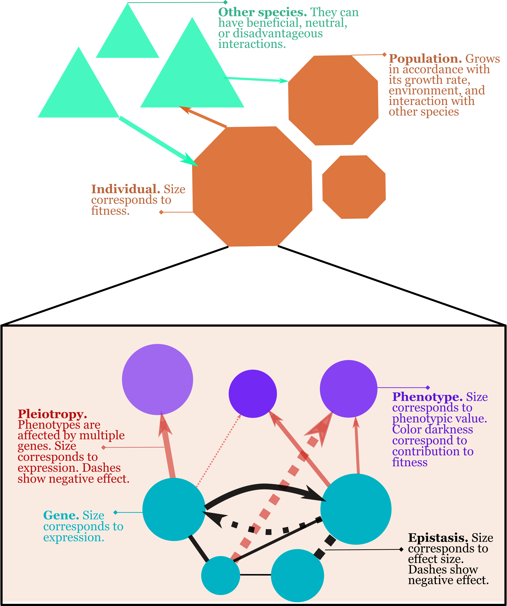

# EvoDynamics.jl Documentation

EvoDynamics.jl is a framework to bridge the gap in studying biological systems at small and large scales. Specifically, it allows modeling biological dynamics at evolutionary and ecological scale. Genotypes affect phenotypes, and they interact with ecology (i.e. environment and other species). The flow of causal effect runs in both directions. Such changes affect adaptation, population demography, and species coexistence. Such eco-evolutionary feedbacks occur when the speed of evolution is fast; populations need to constantly adapt to changing conditions. This happens in antagonistic interactions between species (e.g. predator-prey or parasitism), competitive interactions, and mutualistic interactions.  

Some studies only focus on single genes affecting single phenotypes, some studies only analyze gene interactions, some focus on populations, and some on species interactions. EvoDynamics.jl is a framework to study the effect of interactions between all these levels. It includes an explicit genotype-phenotype architecture (pleiotropy and epistasis), selection acting on multiple phenotypes, different phenotypes affecting fitness at different amounts, arbitrary spatial structure, migration, and interacting species.

Figure below shows different biological levels controlled by the model.

See [Tutorial](@ref) for running the model, and [Model description](@ref) for a description of model parameters and simulation outline.

## Features

* Possibility to model complex food webs with various asymmetrical interactions.
* Individuals interact with one another and with the environment given their phenotypes.
* Connecting genome structure to phenotypes to populations.
* Space is a grid on which individuals can migrate.
* Possibility to model a complex environment with spatio-temporally varying resources.
* Allows time varying optimal phenotypic value per site per species.
* Possibility of killing individuals at certain times and sites.
* Modeling both haploid and diploid species.
* Time-variable selection strength.
* Includes mutation and recombination.
* Easy data collection.
* Runs replicates and collects data in a table automatically.
* Can run replicated in parallel.
